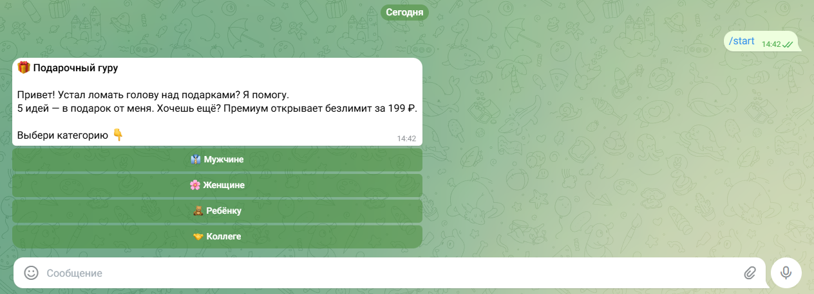
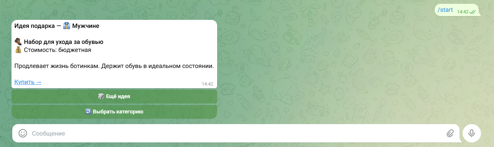
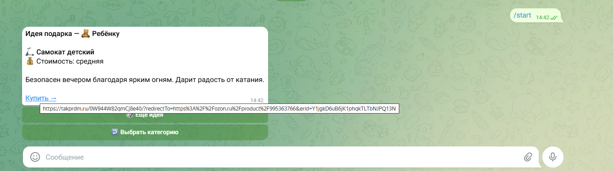
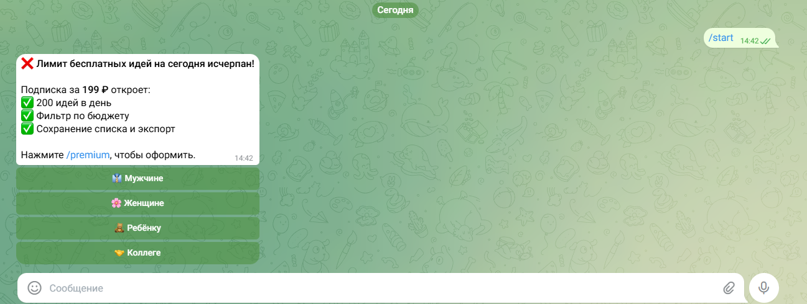

# 🎁 Подарочный гуру — Telegram-бот для выбора подарков

## 🎯 Задача бизнеса
Люди тратят часы на поиск идей подарков. Нужен инструмент, который быстро предлагает варианты, стимулирует покупку и приносит доход.

## 💡 Решение
Telegram-бот с бесплатным тарифом (5 идей/день) и премиум-доступом (199 ₽, безлимит + фильтр по бюджету).

## 🛠 Технологический стек
- Python + `python-telegram-bot`
- SQLite (хранение премиум-статуса)
- Flask (healthcheck для Render)
- Render (деплой)
- Git (контроль версий)

## ✨ Моя роль (промпт-инженер + разработчик)
- Разработала архитектуру бота (клавиатуры, сценарии, лимиты).
- Написала промпты для генерации базы из 100+ идей подарков (использовала few-shot, role prompting).
- Реализовала freemium-модель: 5 бесплатных идей в день, сброс в полночь, премиум-активация через SQLite.
- Интегрировала платёжную ссылку (CryptoCloud, ручная активация — временно, в планах автоматизация через вебхук).
- Настроила деплой на Render и постоянное хранение данных.

## 📊 Результат
- Бот работает 24/7, доступен по ссылке: [@gift_ideas_2026_bot](https://t.me/gift_ideas_2026_bot)
- База содержит 100+ идей, разбитых на 4 категории.
- Есть реальные пользователи (ожидаем первые продажи после настройки платежей).

| Приветствие | Выбор категории | Пример идеи | Лимит идей |
|-------------|----------------|-------------|-------------|
|  |  |  |  |
